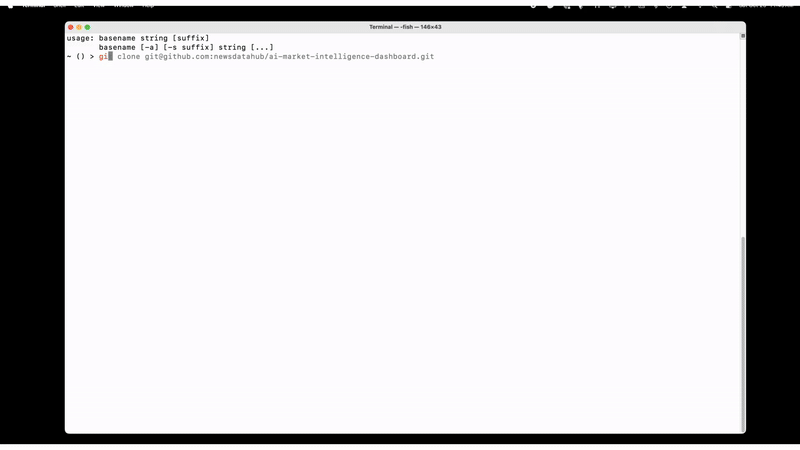
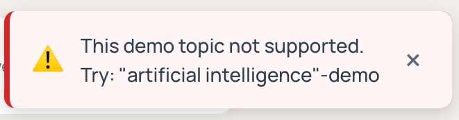
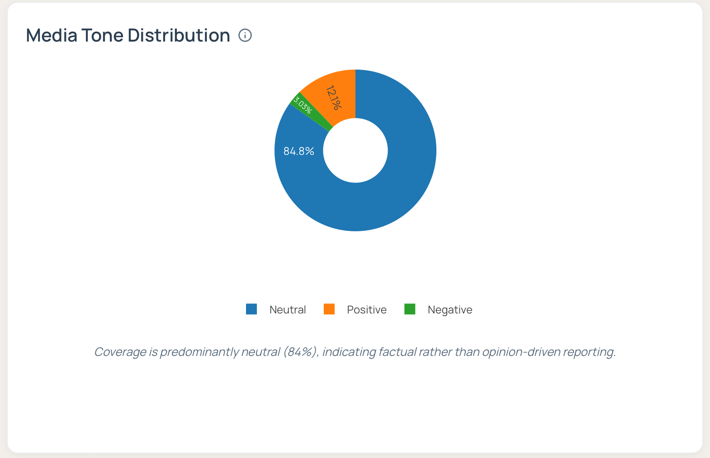
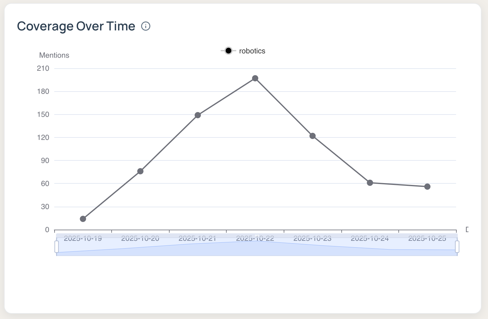
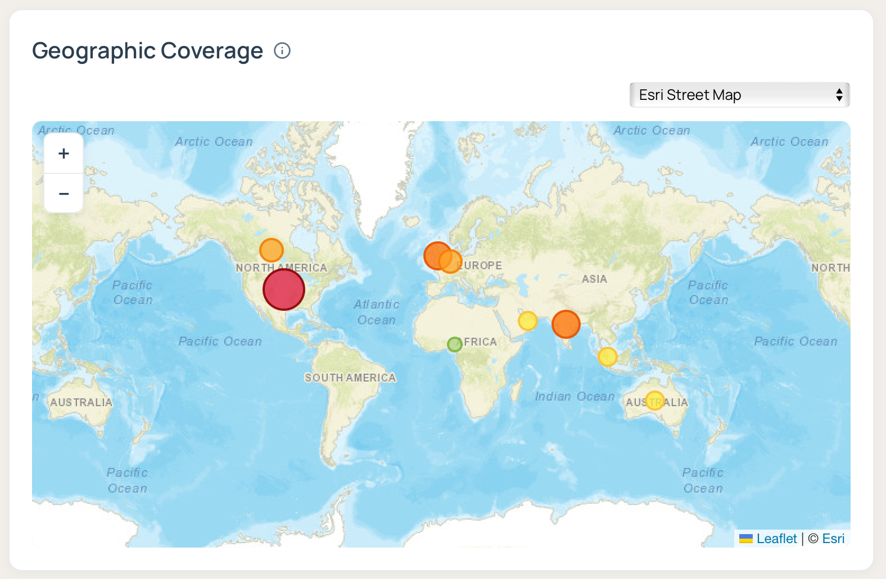
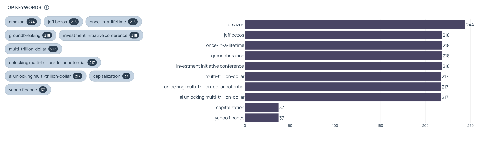
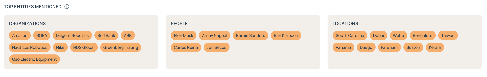
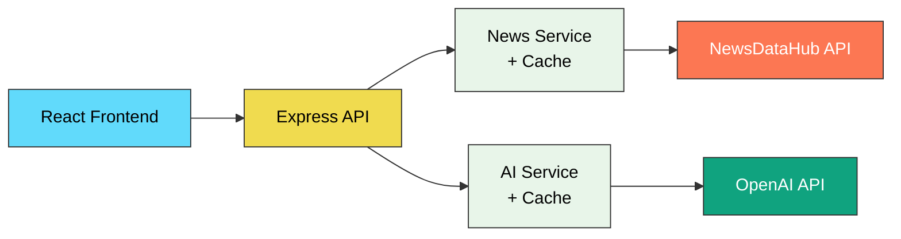

# AI Market Intelligence Dashboard

[](LICENSE)


[](https://newsdatahub.com)

A full-stack tutorial and open-source demo that combines **real-time news aggregation** via the [NewsDataHub API](https://newsdatahub.com) with **AI-powered summarization** via [OpenAI](https://platform.openai.com/).
The project shows how to build a market-intelligence dashboard with TypeScript, React, Express, and GPT-4-powered insights.

> ⚠️ This tutorial **requires** both a NewsDataHub API key and an OpenAI API key for full functionality.
> A built-in **Demo Mode** is also available — no keys required (see below).

---

## Table of Contents

* [Overview](#overview)
* [Demo](#demo)
* [Features](#features)
* [How It Works](#how-it-works)
* [Architecture](#architecture)
* [Prerequisites](#prerequisites)
* [Quick Start](#quick-start)
* [Example Reports](#example-reports)
* [FAQ](#faq)
* [Contributing](#contributing)
* [License](#license)

---

## Overview

The **AI Market Intelligence Dashboard** tracks and analyzes news coverage across topics, geographies, and time periods.
It combines structured news data from **NewsDataHub** with **AI summarization** to produce professional-grade intelligence reports.

**Use cases**

* Track emerging industry trends
* Generate executive summaries and contextual insights
* Analyze geographic coverage patterns
* Export PDF reports for stakeholders

---

## Demo

You can try the dashboard instantly — **no API keys required** — using the **demo topic mode**.



### How to Use Demo Mode

1. Clone the repository:
   ```bash
   git clone https://github.com/newsdatahubapi/ai-market-intelligence-dashboard.git
   cd ai-market-intelligence-dashboard
   ```

2. Copy the environment files:
   ```bash
   cp backend/.env.example backend/.env
   cp frontend/.env.example frontend/.env
   ```

3. Start the application with Docker:
   ```bash
   docker compose up
   ```

4. Navigate to [http://localhost:5173](http://localhost:5173) in your browser.

5. Enter the demo topic in the search bar:
   ```
   "artificial intelligence"-demo
   ```

6. The app will instantly display:
   * Topic Analysis dashboard with charts and metrics
   * AI-Powered News Brief (main report)
   * Timeline Insights (pre-generated)
   * Regional Insights (pre-generated)

> 💡 **Note:** If you enter an unsupported demo topic, you'll see a 10-second toast notification suggesting valid alternatives. If you enter a regular topic without API keys configured, you'll see which environment variables need to be set.

> 


**Currently supported demo topics:**

* `"artificial intelligence"-demo`

All demo responses are pre-cached JSON files and work without API access or network requests.

### Demo Implementation Details

**How It Works:**

* `isDemoMode(topic)` checks if topic ends with `-demo` suffix
* Demo data stored in `backend/src/demo-data/<topic>/`:
  * `topic-analysis.json` - Dashboard metrics and charts data
  * `context-analysis.json` - Main AI report
  * `context-geo.json` - Regional insights report
  * `context-spike.json` - Timeline insights report
  * `search-topic.json` - Articles for timeline
  * `country-coverage.json` - Articles for geographic analysis

**Backend Services:**

* `demoDataService.ts` - Core demo detection and data loading
* `topicAnalysisService.ts` - Returns demo data immediately for analysis
* `routes/news.ts` - Returns demo articles for search/country endpoints
* `routes/intelligence.ts` - Returns demo reports for AI insights

**Frontend Behavior:**

* Auto-triggers all three reports when demo topic is detected:
  1. Main AI-Powered News Brief
  2. Timeline Insights (for highest spike date)
  3. Regional Insights (for top country)
* 10-second toast notifications for unsupported topics or missing API keys

---

## Features

### Interactive Dashboard

* **Topic Analysis** — Query any topic or company name
* **Interactive Visualizations** — Sentiment charts, coverage timeline, geographic map
* **AI-Generated Reports** — GPT-4-based executive summaries
* **Drill-Down Insights** — Filter by date or country for deeper analysis
* **PDF Export** — Professionally formatted downloadable reports

### Data Aggregation

* Real-time news fetching from NewsDataHub API
* Complex keyword queries with boolean operators
* Date-range filters (14, 21 days)
* Smart caching to conserve API calls

### Analysis & Visualization

* **Sentiment Analysis** — Keyword-based scoring (positive/neutral/negative)



* **Coverage Timeline** — Interactive daily trends with spike detection



* **Geographic Map** — Article counts by source country




* **Keyword Extraction** — Frequently mentioned terms



* **Entity Recognition** — OpenAI-powered extraction of people, organizations, locations



### OpenAI Integration

* GPT-4o-mini generates concise intelligence briefs
* Performs entity extraction and contextual explanations
* Creates timeline- and region-specific reports
* Fully integrated into the backend pipeline

### Reporting

* PDF report generation (@react-pdf/renderer)
* Embedded charts and summaries
* Professional formatting for executive distribution
* Automatic disclaimer inclusion

---

## How It Works



**Processing flow**

1. User enters a topic (e.g., "quantum computing") and selects date range.
2. Backend checks for demo mode (`-demo` suffix); if found, returns cached data.
3. For live queries, backend builds optimized NewsDataHub queries.
4. Articles are fetched, paginated, deduplicated.
5. Analysis pipeline extracts sentiment, geography, keywords, sources.
6. Results cached (1h for current day, 24h for historical).
7. OpenAI generates executive summaries and contextual insights.
8. Frontend renders charts, maps, and AI reports.
9. Reports exported to PDF.

---

## Architecture

### Backend (`/backend`)

* **Stack:** Node.js, Express, TypeScript, Winston
* **Modules:**

  * `newsService.ts` – NewsDataHub integration
  * `openaiService.ts` – GPT-4 integration
  * `topicAnalysisService.ts` – sentiment + coverage aggregation
  * `entityExtractionService.ts` – NER via OpenAI
  * `cacheService.ts` – TTL caching
  * `aiReportService.ts` – executive report generator
  * `demoDataService.ts` – demo mode detection and data loading

### Frontend (`/frontend`)

* **Stack:** React 18, TypeScript, Vite, Leaflet, Plotly.js
* **Components:**

  * `AnalysisDashboard.tsx` – main dashboard
  * `TopicInput.tsx` – search interface
  * `charts/` – sentiment & timeline charts
  * `GeographicMap.tsx` – geographic visualization
  * `IntelligenceReport.tsx` – AI report view
  * `ExportReportPDF.tsx` – PDF generation
  * `Toast.tsx` – error/success notifications

---

## Prerequisites

* **Docker:** Latest stable version
* **Docker Compose:** v2.0 or higher
* **API keys (both required for live data):**

  * [OpenAI API key](https://platform.openai.com/) — for report generation
  * [NewsDataHub API key](https://newsdatahub.com) — for article data (free tier ≈ 100 calls/day; see site for current quotas)

> **Note:** Demo mode works without any API keys.

---

## Quick Start

### 1 · Clone

```bash
git clone https://github.com/newsdatahubapi/ai-market-intelligence-dashboard.git
cd ai-market-intelligence-dashboard
```

### 2 · Configure Environment

Copy the example environment files:

```bash
cp backend/.env.example backend/.env
cp frontend/.env.example frontend/.env
```

Then edit `backend/.env` and add your API keys:

```bash
NEWSDATAHUB_API_KEY=your_newsdatahub_key
OPENAI_API_KEY=your_openai_key
```

> **Quick Start with Demo Mode:** You can skip adding API keys and use `"artificial intelligence"-demo` as your search topic to try the dashboard immediately.

### 3 · Run with Docker

```bash
docker compose up
```

Navigate to [http://localhost:5173](http://localhost:5173) to access the dashboard and start analyzing news topics.

---

## Example Reports

You can view example exported PDF reports in the `example-reports/` directory. These demonstrate the three types of reports the dashboard can generate:

* `_gold-mining__News-Brief_2025-09-25-to-2025-10-25.pdf`
* `_quantum-computing__Regional-Insights_GB_2025-10-18-to-2025-10-25.pdf`
* `_semiconductors__Timeline-Insights_2025-10-16.pdf`

---

## FAQ

### **Demo Mode**

**Q: How do I use demo mode?**
Only one demo topic is currently supported: `"artificial intelligence"-demo`. Enter this topic in the search bar and the dashboard will load instantly using pre-cached JSON data. No API keys required.

**Q: Do I need API keys for demo mode?**
No. Demo mode works completely offline — no keys, no API requests.

**Q: Does the demo behave the same as live mode?**
Almost. All charts and reports display identically using stored data instead of real API responses. The main difference is that in demo mode, the Timeline Insights and Regional Insights reports are pre-generated and displayed automatically. In the live application, you would need to click on specific dates in the timeline chart or countries on the map to generate these reports.

**Q: What happens if I enter a non-existent demo topic?**
You'll see a 10-second toast message: `"This demo topic not supported. Try: "artificial intelligence"-demo"`

---

### **API Setup & Usage**

**Q: What API keys are required for live data?**
Both:

* `NEWSDATAHUB_API_KEY` – fetches news articles and metadata.
* `OPENAI_API_KEY` – generates summaries and insights.

**Q: What's the free tier for NewsDataHub?**
≈ 100 calls/day. Visit [newsdatahub.com](https://newsdatahub.com) for the latest quotas and pricing.

**Q: How much does OpenAI cost?**
Each report typically costs ~ $0.05 – $0.15 using `gpt-4o-mini`.

**Q: What happens if I try to use a real topic without API keys?**
You'll see a 10-second toast showing which environment variables are missing:
`"Missing API configuration. Please set the following environment variables: NEWSDATAHUB_API_KEY, OPENAI_API_KEY"`

---

### **Development & Troubleshooting**

**Q: I'm getting "missing API key" errors.**

* Check `.env` in `/backend` for both `NEWSDATAHUB_API_KEY` and `OPENAI_API_KEY`.
* Ensure `VITE_API_BASE_URL` in frontend points to the correct backend port.
* For quick testing, switch to demo mode.

**Q: My topic returns no articles.**

* Broaden the query (remove quotes or use fewer words).
* Extend the date range to 21 days.
* Confirm topic spelling.

**Q: Why is sentiment accuracy not perfect?**
This tutorial uses a keyword-based heuristic (~70–80% accuracy).
For production, replace with an ML model or specialized NLP API.

**Q: How can I change the model or prompt?**
Edit `backend/src/utils/promptUtils.ts`.
Modify `createIntelligenceReportMessages()` for tone/length, or `createContextExplanationMessages()` for drill-downs.

**Q: Can I add more visualization types?**
Yes — extend components in `frontend/src/components/charts/`.

**Q: How do I customize PDF styling?**
Modify the StyleSheet in `frontend/src/components/ExportReportPDF.tsx`.

**Q: How do I deploy this?**

This application is designed as a local development tool and tutorial. However, if you wish to deploy it:

**VPS/Cloud Hosting (DigitalOcean, AWS, GCP, Azure):**
```bash
# On your server
git clone https://github.com/newsdatahubapi/ai-market-intelligence-dashboard.git
cd ai-market-intelligence-dashboard

# Set environment variables
cp backend/.env.example backend/.env
cp frontend/.env.example frontend/.env
nano backend/.env  # Add your API keys

# Run with Docker Compose
docker compose up -d

# Optional: Use nginx as reverse proxy for HTTPS
```

**Platform-Specific Deployment:**
- **Railway.app / Render.com:** Connect GitHub repo, set environment variables, deploy
- **Heroku:** Use Docker deployment with `heroku.yml`
- **Fly.io:** Use `fly launch` with Dockerfile

**Production Considerations:**
- Add HTTPS/SSL (use Let's Encrypt or Cloudflare)
- Set `NODE_ENV=production` in backend
- Update `ALLOWED_ORIGINS` to include your production domain
- Consider Redis for caching instead of in-memory cache
- Set up monitoring/logging (PM2, Datadog, etc.)
- Implement rate limiting for API protection
- Add authentication if making publicly accessible

**Important:** This is a demo/tutorial application. For production use, consider adding proper authentication, database storage, and security hardening.

---

### **Common Error Messages**

**Error:** `"This demo topic not supported. Try: "artificial intelligence"-demo"`
**Cause:** You entered a demo topic that doesn't exist.
**Solution:** Use one of the supported demo topics listed above, or add your own demo data.

**Error:** `"Missing API configuration. Please set the following environment variables: NEWSDATAHUB_API_KEY, OPENAI_API_KEY"`
**Cause:** You tried to search a non-demo topic without setting up API keys.
**Solution:** Either:
1. Set up your API keys in `backend/.env` (see [Quick Start](#quick-start))
2. Use demo mode by adding `-demo` to your topic

---

### **Support & Contact**

**Q: Where can I report bugs or ask questions?**

* GitHub → [Issues](https://github.com/newsdatahub/ai-market-intelligence-dashboard/issues) or Discussions
* Email → [support@newsdatahub.com](mailto:support@newsdatahub.com)
* [NewsDataHub Docs](https://docs.newsdatahub.com)
* [OpenAI Docs](https://platform.openai.com/docs)

**Q: Why only English?**
This tutorial filters English articles to keep sentiment and NER consistent.
NewsDataHub API itself supports 80+ languages.

---

## Contributing

Pull requests welcome!

1. Fork → `git checkout -b feature/my-feature`
2. Commit → `git commit -m "Add feature: X"`
3. Push → `git push origin feature/my-feature`
4. Open PR with details

---

## Usage & Disclaimer

This project is for **educational and demonstration purposes only**.
AI-generated summaries may contain inaccuracies and are **not professional or financial advice**.
Each exported report includes this disclaimer automatically.

---

## License

MIT License – see [LICENSE](LICENSE)

---

**Built with:**
[NewsDataHub API](https://newsdatahub.com) · [OpenAI GPT-4o-mini](https://platform.openai.com/) · [React](https://react.dev) · [Express](https://expressjs.com) · [TypeScript](https://typescriptlang.org) · [Leaflet](https://leafletjs.com) · [Plotly.js](https://plotly.com/javascript/)

**Maintained by:** NewsDataHub Team

